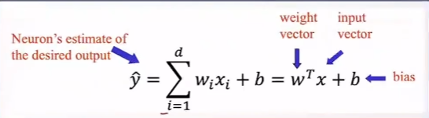
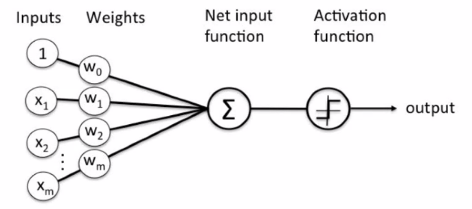
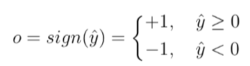
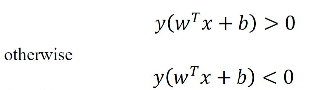
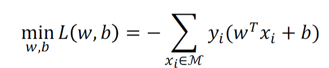
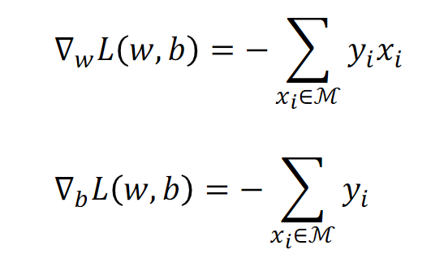

# Deep Learning Notes
## Multi-layer Neural Networks
### Perceptron 感知器
- 输入信号(x1, x2, ...xm) -> 突触权值(w1, w2, ...Wm) -> bias(b) -> 激活函数φ() -> 输出 yi  
- the decision rule 
- if example can be correctly classified 
- 分类错误会有损失，M是分错的集合。Objective function of Perceptron can be written as: 
- 用梯度下降来解决优化问题 Gradient descent to solve the optimization problem. 
- 局限性：由于激活函数使用的sign，导致感知器是线性函数，无法拟合非线性数据

### Multi-layer Neural Network (多层感知器，多层神经网络）
- 1986年 Geoffrey Hinton, David Rumelhart, and Ronald Williams提出反向传播(Backpropagation) 和 隐藏层(Hidden Layer)
  - 反向传播：通过不断修改参数减小预测值和真实值之间的差异。Backpropagation, a procedure to repeatedly adjust the  weights so as to minimize the difference between actual output and desired output
  - 隐藏层：通过在input和output层之间增加神经元，让模型可以学习复杂的非线性特征。Hidden Layers, which are neuron nodes stacked in between inputs and outputs, allowing neural networks to learn more complicated features (such as XOR logic) 19分钟14秒 page 12
- 结构：输入层 / 隐藏层 / 输出层

